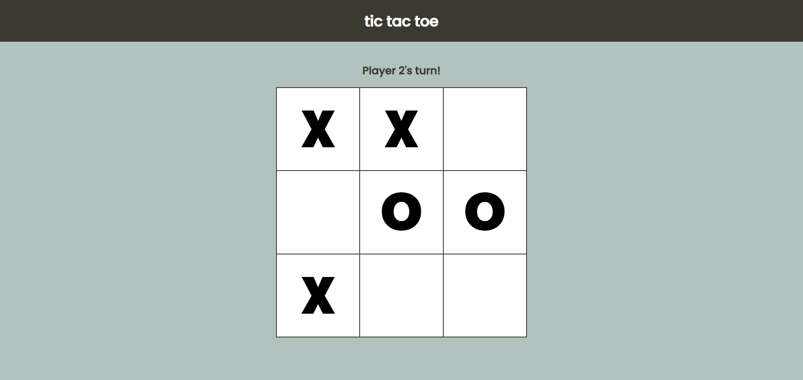

## Table of contents

- [Overview](#overview)
  - [The challenge](#the-challenge)
  - [Screenshots](#screenshots)
- [My process](#my-process)
  - [Built with](#built-with)

## Overview

### The challenge

- Created a Tic Tac Toe game as part of [The Odin Project](https://www.theodinproject.com)
- Live demo: https://itskharina.github.io/tic-tac-toe/

Users should be able to:

- Play Tic Tac Toe against another person

### Screenshots

## My process

### Built with

- Semantic HTML5 markup
- CSS (Grid and Flexbox)
- SCSS
- JavaScript
